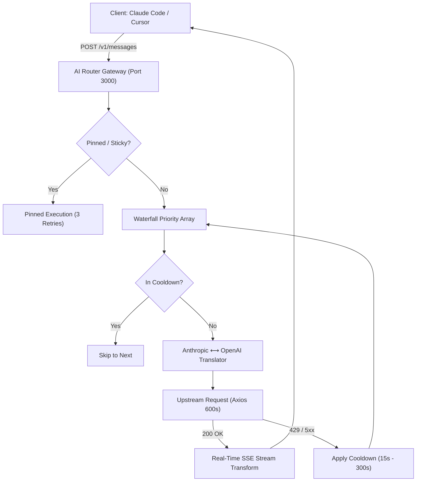

# 🚦 AI Router (v2.0)
### Universal High-Availability LLM Gateway & Smart Failover Middleware

[](https://nodejs.org/)
[](https://opensource.org/licenses/MIT)
[](https://expressjs.com/)
[]()

**AI Router** is an asynchronous reverse-proxy and protocol-adapting API gateway for AI-assisted development tools (Claude Code CLI, Cursor, VS Code, etc.). 

It aggregates multiple free, local, and cloud AI providers into a single unified endpoint with **automated failover**, **exponential backoff circuit breaking**, and **real-time Server-Sent Events (SSE) streaming translation**.

---

## ✨ Key Features

- **🛡️ Autonomous Failover & Circuit Breaker:** If a provider hits HTTP 429 (rate-limit) or 5xx downtime, AI Router immediately routes to the next model with exponential backoff cooldown ($15\text{s}$ to $300\text{s}$).
- **🔄 Real-time Protocol & SSE Stream Converter:** Bi-directionally translates between Anthropic Messages API and OpenAI Chat Completions specifications on-the-fly with zero buffer bloat.
- **⚡ 1-Command Interactive Setup Wizard:** `npm run setup` walks you through adding your free keys (Gemini, OpenCode, Nara) and auto-creates a Windows Desktop shortcut.
- **🎛️ Modern Web Dashboard:** Live status monitoring, provider health telemetry, model switching, dynamic key management, and 1-click model batching at `http://localhost:3000`.
- **➕ Multi-Model Batch Addition:** Add multiple models from a single provider with a comma-separated list (e.g. `llama-3.3-70b, deepseek-r1, mixtral-8x7b`) in one click.
- **🔒 Pinned Exclusive & Sticky Routing:** Locks onto working models during long coding sessions to prevent context fragmentation.
- **⏱️ 10-Minute Extended Reasoning Timeout:** Allows deep-thinking models (DeepSeek R1, Nemotron Ultra) up to 600 seconds to generate complex codebases.

---

## 🚀 Quickstart (Fresh PC Setup)

### 1. Clone & Install Dependencies
```bash
git clone https://github.com/<your-username>/ai-router.git
cd ai-router
npm install
```

### 2. Run the Interactive Setup Wizard
```bash
npm run setup
# Or double-click setup.bat on Windows
```
The wizard will:
1. Ask for your free **Google Gemini** API key (Unlocks 5 flagship Google models).
2. Ask for your free **OpenCode** API key (Unlocks 6 coding models).
3. Automatically configure `.env`.
4. Automatically create a **Desktop Shortcut** for the Web Dashboard.

### 3. Start AI Router
```bash
npm start
# Or double-click START.vbs for silent background execution
```
Dashboard opens at: **`http://localhost:3000`**

---

## 📡 Client Configuration

### Claude Code CLI
Add this to your `~/.claude/settings.json` (or `%USERPROFILE%\.claude\settings.json` on Windows):
```json
{
  "env": {
    "ANTHROPIC_BASE_URL": "http://localhost:3000",
    "ANTHROPIC_API_KEY": "router-handles-this",
    "ANTHROPIC_MODEL": "AI-Router-Pro"
  }
}
```

### Cursor / VS Code / OpenAI Compatible Tools
- **API Base URL:** `http://localhost:3000/v1`
- **API Key:** `router-handles-this` (or any string)
- **Model:** `auto` or any model ID from the dashboard

---

## 🛠️ CLI Commands

```bash
ai-router start       # Start the AI Router gateway
ai-router setup       # Run the interactive setup wizard
ai-router dashboard   # Open the web dashboard in your default browser
ai-router status      # Check health probe and active provider count
```

---

## 🏛️ System Architecture



---

## 📄 License
This project is licensed under the [MIT License](LICENSE).
